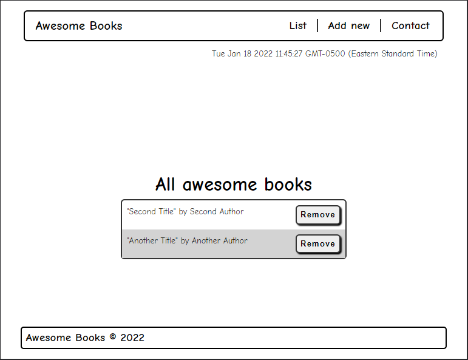

# Awesome books: with ES6

## Built With

- HTML, CSS and JavaScript

## Live Link
[Live Demo Link](https://craigs40.github.io/BooksES6/)

### Setup

- Use the green "Code" button at the top of the repo to clone this project using one of the three options:
   - Open a terminal or a git bash in the desired directory and run `https://github.com/craigs40/BooksES6.git`
   - Open with Github Desktop
   - Download the ZIP file

## Authors

👤 **Shay Craig**

- GitHub: [@craigs40](https://github.com/craigs40)

## 🤝 Contributing

Contributions, issues, and feature requests are welcome!

Feel free to check the [issues page](https://github.com/craigs40/BooksES6/issues).

## Show your support

Give a ⭐️ if you like this project!

## Acknowledgments

- Hat tip to anyone whose code was used
- Special thanks to CRs

## 📝 License

This project is [MIT](./MIT.md) licensed.